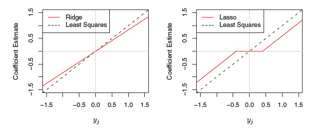

```{r setup, include=FALSE}
options(htmltools.dir.version = FALSE)
knitr::opts_chunk$set(
  eval = TRUE,
  echo = TRUE,
  warning = FALSE,
  message = FALSE,
  cache = FALSE,
  dev = "svglite",
  fig.ext = ".svg")

htmltools::tagList(rmarkdown::html_dependency_font_awesome())
```


# Packages and setup

Use the [pacman](https://cran.r-project.org/web/packages/pacman/vignettes/Introduction_to_pacman.html) package that automatically loads and installs packages:

```{r pacman, message=FALSE, warning=FALSE, eval=TRUE}
if (!require("pacman")) install.packages("pacman")

pacman::p_load(
  tidyverse,   # for data wrangling and visualization
  knitr,       # for displaying nice tables
  broom,       # for tidying estimation output
  here,        # for referencing folders and files
  glmnet,      # for estimating lasso and ridge
  gamlr        # for forward stepwise selection
)
```

Set a theme for `ggplot` (Relevant only for the presentation)
```{r ggplot_theme}
theme_set(theme_grey(20))
```

And set a seed
```{r}
set.seed(1203)
```

---

# Resources on hige-dimensional statsitics

.pull-left[
- [_Statistical Learning with Sparsity - The Lasso and Generalizations_](https://web.stanford.edu/~hastie/StatLearnSparsity/)  (Hastie, Tibshirani, and Wainwright),
(PDF available online)

- [_Statistics for High-Dimensional Data - Methods, Theory and Applications_](https://www.springer.com/gp/book/9783642201912) (Buhlmann and van de Geer)

- [_High Dimensional Statistics - A Non-Asymptotic Viewpoint_](https://www.cambridge.org/core/books/highdimensional-statistics/8A91ECEEC38F46DAB53E9FF8757C7A4E) (Wainwright)
]

.pull-right[
```{r, echo=FALSE, out.width = "100%", fig.align='center'}
knitr::include_graphics("figs/sparsebooks3.png")
```
]


---
# Outline

 - [Linear regression](#linear)  

 - [Subset selection](#subset)  

 - [Shrinkage](#shrink)  

 - [Dimension Reduction](#dim)  

 - [Hands-on](#hands)  


---
class: title-slide-section-blue, center, middle
name: linear

# Linear Regression

---

# Econometrics

In econometrics, we typically assume a "true" linear data generating process (DGP):

$$y_{i}=\beta_{0}+\sum_{j=1}^{p} x_{i j} \beta_{j}+\varepsilon_{i}$$

where $y_i$ is the outcome variable, $x_{ij},\ldots,x_{ip}$ is a set of explanatory or control variables (+ interactions, polynomials, etc.), and $\varepsilon_i$ is the regression error.  

__sample__ : $\{(x_1,\ldots,x_p,y_i)\}_{i=1}^{n}$

---

# Estimation

Ordinary least squares minimizes

$$\underset{\beta_{0}, \beta}{\operatorname{min}} \sum_{i=1}^{N}\left(y_{i}-\beta_{0}-\sum_{j=1}^{p} x_{i j} \beta_{j}\right)^{2}$$
The emphasis here is on in-sample fit (minimize residual sum of squares).


Typical workflow:
- impose identifying assumptions (causal claims).
- estimate $\beta_0,\ldots,\beta_p$ using the entire sample.
- assume a random sample from a larger population.
- hypothesis testing.


---
# Supervised Learning

Consider the following linear data generating process (DGP):

$$y_{i}=\beta_{0}+\sum_{j=1}^{p} x_{i j} \beta_{j}+\varepsilon_{i}$$
where $y_i$ is the predicted (response) variable, $x_{i1},\ldots,x_{ip}$ is a set of "features", and $\varepsilon_i$ is the irreducible error.  

- __Training set__ : $\{(x_{1i},\ldots,x_{ip},y_i)\}_{i=1}^{n}$
- __Test set__ : $\{(x_{1i},\ldots,x_{ip},y_i)\}_{i=n+1}^{m}$

<midd-blockquote>
Typical assumptions: (1) independent observations; (2) stable DGP across training _and_ test sets.
</midd-blockquote>

Our object of interest is $\widehat{y}_i$, predicting unseen data.


---

# Dffierent objective, different approach

To illustrate how these two approaches (estimation vs. prediction) differ, consider the following data generating process<sup>1</sup>:

$$y_i = \beta_0 + \beta_1 x_i + \varepsilon_i,\qquad \varepsilon_i\sim N(0,\sigma^2)$$
where $\beta_0=0$ and $\beta_1=2$.

Next, suppose you get a sample of size $N$ and use it to estimate the model and get (standard errors in parentheses):

$$\begin{aligned}
&y_{i}=0.0\hspace{0.35cm}+\hspace{0.35cm}2.0\times x_{i}+\widehat{\varepsilon}_{i}\\
&\hspace{1.4cm}(0.2)\hspace{0.85cm}(10.0)
\end{aligned}$$

Given a new unseen $x^0$ and the output above, how would you predict $y^0$?

.footnote[
[1] Adapted from Susan Athey's lecture.
]

---

# Standard errors and prediction accuracy

- OLS is lexicographic in the sense that it first ensure unbiasedness, then efficiency.

- OLS is unbiased, hence you would be right _on average_, but. Is that what we want?

- If your estimated coefficient is noisy (high std. error), so will be your prediction (high variability).

- Bias-variance trade off again.

- Prediction is about balancing bias and variance.


__NOTE:__ in multivariate regression, things are more complicated due to the correlation structure of the $x$'s.

---

# Illustration: Browse data

In this lecture, we will use Matt Taddy's __browser dataset__ (available in our repo) which contains web browsing logs for 10,000 people. Taddy has extracted a year’s worth of browser logs for the 1000 most heavily trafficked websites. Each browser in the sample spent at least $1 online in the same year.

The goal of estimation: predict spending from browser history:

$$\log(spend_i) = \beta_0 + \beta'visits_i + \varepsilon_i,\qquad \text{for }i=1,\ldots,n$$
where $visits_i$ is a vector site-visit percentage. This model can be used to segment expected user budget as a function of browser history.

---

# Load data

In this lecture we will only use a sample from the browser dataset: 250 websites and 1000 users.

```{r}
load(here("05-regression-regularization/data","Xweb.Rdata")) # log spend_i
load(here("05-regression-regularization/data","Yweb.Rdata")) # visits_i
```

Log spending by the first user and the fraction of times she spent on the first 4 websites:
```{r}
Yweb[1,]
```

```{r}
Xweb[1, 1:4]
```

__NOTE:__ The design matrix `Xweb` is sparse.


---

# Results

Estimate the model using `lm()`
```{r}
fit_lm <- lm(Yweb ~ Xweb)
```

Show estimation output, sorted by $p$-values
```{r}
fit_lm %>% 
  tidy() %>% 
  arrange(p.value) %>% 
  mutate(term = map_chr(term, ~ str_remove(., "Xweb"))) %>% 
  head(5) %>% 
  kable(format = "html", digits = 2)
```

---

# Model perfoemance

What is the training-set MSE<sup>1</sup>?

```{r}
fit_lm %>% 
  glance() %>% 
  mutate(MSE = deviance / 1000) %>% 
  select(MSE) %>% 
  kable(format = "html", digits = 3)
```

This is clearly an _underestimate_ of the test set MSE.


.footnote[
[1] In the case of a linear regression model, deviance is defined as the sum of squares.
]


---
class: title-slide-section-blue, center, middle
name: linear

# Penalized linear regression

---

# Estimation

_Penalized_ (or _regularized_) sum of squares minimizes solves

$$\underset{\beta_{0}, \beta}{\operatorname{min}} \sum_{i=1}^{N}\left(y_{i}-\beta_{0}-\sum_{j=1}^{p} x_{i j} \beta_{j}\right)^{2} \text { subject to }R(\beta) \leq t$$
where $R(\cdot)$ is a penalty function that measures __expressiveness__ of the model.

As the number of features grow, linear models become _more_ expressive. 


---

# Notation: Norms


Suppose $\boldsymbol{\beta}$ is a $k\times 1$ vector with typical element $\beta_i$. 

- The $\ell_0$-norm is defined as $||\boldsymbol{\beta}||_0=\sum_{j=1}^{k}\boldsymbol{1}_{\{\beta_j\neq0\}}$, i.e., the number of non-zero elements in $\boldsymbol{\beta}$.  

- The $\ell_1$-norm is defined as $||\boldsymbol{\beta}||_1=\sum_{j=1}^{k}|\beta_j|$.  

- The $\ell_2$-norm is defined as $||\boldsymbol{\beta}||_2=\left(\sum_{j=1}^{k}|\beta_j|^2\right)^{\frac{1}{2}}$, i.e., Euclidean norm.  


---
# Commonly used penaltiy functions

It is often convenient to rewrite the regularization problem in the Lagrangian form:

$$\underset{\beta_{0}, \beta}{\operatorname{min}} \sum_{i=1}^{N}\left(y_{i}-\beta_{0}-\sum_{j=1}^{p} x_{i j} \beta_{j}\right)^{2}+\lambda R(\beta)$$
__NOTE:__ There is one-to-one correspondence between $\lambda$ and $t$.

|  Method          |  $R(\boldsymbol{\beta})$             | 
|:-----------------|:-------------------------------------|
| OLS              | 0                                    |
| Subset selection | $\lVert\boldsymbol{\beta}\rVert_0$   |
| Lasso            | $\lVert\boldsymbol{\beta}\rVert_1$   |
| Ridge            | $\lVert\boldsymbol{\beta}\rVert_2^2$ |
| Elastic Net<sup>1</sup>      | $\alpha\lVert\boldsymbol{\beta}\rVert_1 + (1-\alpha)\lVert\boldsymbol{\beta}\rVert_2^2$             |


.footnote[
[1] Will not be covered in this lecture. Essentially, a fancy name for combining ridge and lasso.
]


---
class: title-slide-section-blue, center, middle
name: subset

# Best subset selection


---

# Our goal


$$\underset{\beta_{0}, \beta}{\operatorname{min}} \sum_{i=1}^{N}\left(y_{i}-\beta_{0}-\sum_{j=1}^{p} x_{i j} \beta_{j}\right)^{2} \text { subject to }\lVert\boldsymbol{\beta}\rVert_0 \leq t$$

__In words__: select the best model according to some statistical criteria, among all possible combination of $t$ feature or less.

---

#  Best subset selection algorithm

1. For $k=0,1, \ldots ,p$

 1.1 Fit all models that contain exactly $k$ predictors. If $k=0$, the forecast is the unconditional mean.
 
 1.2 Pick the best (e.g, highest $R^2$) among these models, and denote it by $\mathcal{M}_{k}$.
 
2. Optimize over $\{\mathcal{M}_{0}, \ldots, \mathcal{M}_{p}\}$ using cross-validation (or other criteria) 


Issues:

1. The algorithm is very slow: at each step we deal with $p \choose k$ models ("N-P complete".)
2. The prediction is highly unstable: the subsets of variables in $\mathcal{M}_{10}$ and $\mathcal{M}_{11}$ can be very different from each other, leading to high variance (the best subset of $\mathcal{M}_3$ need not include any of the variables in best subset of $\mathcal{M}_2$.)


---

# Faster subset selection algorithms

Instead of estimating all possible combinations, follow a particular path of models:

- Forward stepwise selection: start simple and expand (feasible even if $p>n$)

- Backward stepwise selection: start with the full model and drop features (not recommended)


---

# Forward stepwise algorithm

1. Let $\mathcal{M}_{0}$ denote the null model, which contains just an intercept.

2. For $k=0, \ldots, p-1:$

  2.1 Consider all $p-k$ models that augment the predictors in $\mathcal{M}_{k}$ with one additional predictor.
  
  2.2 Choose the best among these $p-k$ models, and call it $\mathcal{M}_{k+1} .$ Here best is defined as having highest $R^{2}$
  
3. Select a single best model from among $\mathcal{M}_{0}, \ldots, \mathcal{M}_{p}$ using cross-validation.

<midd-blockquote>
This is our first example of a __greedy algorithm__: a making the locally optimal selection at each stage with the intent of finding a global optimum.</midd-blockquote>

---

# Stepwise using `gamlr`

.pull-left[
[`gamlr`](https://github.com/TaddyLab/gamlr) is an R package that enables you, among other things, to estimate a forward stepwise regression model.

```{r step, fig.show='hide'}
fit_step <- gamlr(Xweb, Yweb, gamma=Inf, lmr=.1)
plot(fit_step, df=FALSE, select=FALSE)
```
The figure on the right shows the value of the coefficients along the forward stepwise selection path. 

Notice how the jagged are the solution paths. This discontinuity is the cause for instability in subset selection algorithms.
]
.pull-right[
```{r, ref.label = 'step', echo=FALSE}

```
]


---
class: title-slide-section-blue, center, middle
name: shrink

# Shrinkage


---

# Prerequisite: centering and scaling

In what follows, we assume that each feature is centered and scaled to have mean zero and unit variance, as follows:

$$\frac{x_{ij} - \widehat\mu_i}{\widehat\sigma_{i}}, \qquad\text{for }j=1,2, \ldots, p$$

where $\widehat\mu_i$ and $\widehat\sigma_i$ are the estimated mean and standard deviation of $x_i$ estimated over the _training_ set.

__NOTE:__ This is not important when using OLS (why?)


---

# The ridge regression

Ridge regression was introduced into the statistics literature by Hoerl and Kennard (1970).The optimization problem:
$$\underset{\beta_{0}, \beta}{\operatorname{min}} \sum_{i=1}^{N}\left(y_{i}-\beta_{0}-\sum_{j=1}^{p} x_{i j} \beta_{j}\right)^{2}+\lambda \lVert\boldsymbol{\beta}\rVert_2^2$$
or in a budget constraint form:
$$\underset{\beta_{0}, \beta}{\operatorname{min}} \sum_{i=1}^{N}\left(y_{i}-\beta_{0}-\sum_{j=1}^{p} x_{i j} \beta_{j}\right)^{2} \text { subject to }\lVert\boldsymbol{\beta}\rVert_2^2 \leq t$$

Ridge puts a "budget constraint" on the sum of squared betas. This constraint incorporate the cost of being "too far away" from the null hypothesis of $\beta_j=0$ (what if this assumption is wrong null?)

---

# Illistration of ridge in 2-D

.pull-left[

Contours of the error and constraint functions for ridge regression. The solid blue area is the constraint region, $\beta_{1}^{2}+\beta_{2}^{2} \leq t,$ while the red ellipses are the contours of the RSS and $\widehat\beta$ is the OLS estimator.

]

.pull-right[

```{r, echo=FALSE, out.width = "70%", fig.align='center'}

knitr::include_graphics("figs/ridge.png")

```

Source: [James et al. (2017) ](http://faculty.marshall.usc.edu/gareth-james/ISL/index.html) 

]

---

<blockquote class="twitter-tweet" data-lang="he"><p lang="en" dir="ltr">Illustration of the Lasso and its path in 2D: for t small enough, the solution is sparse! <a href="https://t.co/0JV23e32DF">pic.twitter.com/0JV23e32DF</a></p>&mdash; Pierre Ablin (@PierreAblin) <a href="https://twitter.com/PierreAblin/status/1107625298936451073?ref_src=twsrc%5Etfw">March 18 2019</a></blockquote>
<script async src="https://platform.twitter.com/widgets.js" charset="utf-8"></script>

---

# The solution

The problem in matrix notation:

$$\underset{\boldsymbol{\beta}}{\operatorname{min}}\:\:(\mathbf{y}-\mathbf{X} \boldsymbol{\beta})^{\prime}(\mathbf{y}-\mathbf{X} \boldsymbol{\beta})+\lambda \boldsymbol{\beta}^{\prime} \boldsymbol{\beta}$$
The ridge estimator is given by
$$\widehat{\boldsymbol{\beta}}^{\text {R}}=\left(\mathbf{X}^{\prime} \mathbf{X}+\lambda \mathbf{I}\right)^{-1} \mathbf{X}^{\prime} \mathbf{y}$$
__NOTE:__ We can have a solution even if $\mathrm{X}$ is not of full rank (e.g., due to multicollinearity) since $\mathbf{X}^{\prime} \mathbf{X}+\lambda \mathbf{I}$ is non-singular.


---

# Bayesian interpretaion of ridge

- Consider the regression
$$y_{i}\sim N\left(\mathbf{x}_i^{\prime}\boldsymbol{\beta} , \sigma^2\right)$$
where we assume that $\sigma$ is known.

- Suppose we put an independent prior on each $\beta_{j}$

$$\beta_{j} \sim \mathcal{N}\left(0, \tau^{2}\right)$$

- Then, the posterior mean for $\boldsymbol{\beta}$ is 

$$\widehat{\boldsymbol{\beta}}_{\text {posterior}}=\left(\mathbf{X}^{\prime} \mathbf{X}+\frac{\sigma^{2}}{\tau^{2}} \mathbf{1}\right)^{-1} \mathbf{X}^{\prime} \mathbf{y}$$

- Hence, $\lambda = \frac{\sigma^{2}}{\tau^{2}}$.

---

# Estimating ridge using `glmnet`

.pull-left[
The R package `glmnet` enables you to estimate ridge regression, along with its path for $\lambda$.

To do so, we need to maker sure to set `alpha = 0`.
```{r ridge, fig.show='hide'}
fit_ridge <- glmnet(x = Xweb, y = Yweb, alpha = 0)
plot(fit_ridge, xvar = "lambda")
```
The figure on the right shows the ridge __regularization path__, i.e., the values of the (standardized) coefficients for different values of (log) $\lambda$.
]
.pull-right[
```{r, ref.label = 'ridge', echo=FALSE}

```
]

---

# How to choose $\lambda$?

$K$-fold cross validation algorithm:

1. Given a training set of $n$ observations, randomly split the data into $K$ roughly evenly sized folds (subsamples).

2. For $k=1, \ldots, K$
  2.1 Fit the coefficients $\bar{\beta}$ using all but the $k$ th fold of data.
  2.2 Record MSE on the left-out $k^{\text{th}}$ fold.

---

# Tuning $\lambda$

.pull-left[
The function `cv.glmnet()` automates cross validation for the ridge regression. 

Note that you can change the default number of folds (10) by setting `nfolds` argument.

```{r cv_ridge, fig.show='hide'}
cv_ridge <- cv.glmnet(x = Xweb, y = Yweb, alpha = 0)
plot(cv_ridge)
```

- _Left_ dotted vertical line: $\lambda$ with min MSE
- _Right_ dotted vertical line: the biggest $\lambda$ with MSE no more than one SE away from the minimum

]
.pull-right[
```{r, ref.label = 'cv_ridge', echo=FALSE}

```
]

---

# Pros and cons of ridge

__PROS:__

- when $p$ is large, ridge significantly reduces variance (by introducing bias.)
- works even when $p>n$.

__CONS:__

- Though ridge shrinks all of the coefficients toward zero, it does not set any of them to exactly zero. Hence, when $p$ is large, interpretation remains a challenge.


---

# The lasso

Lasso (least absolute shrinkage and selection operator)  was introduced by Tibshirani (1996). The optimization problem:
$$\underset{\beta_{0}, \beta}{\operatorname{min}} \sum_{i=1}^{N}\left(y_{i}-\beta_{0}-\sum_{j=1}^{p} x_{i j} \beta_{j}\right)^{2}+\lambda \lVert\boldsymbol{\beta}\rVert_1$$

Lasso puts a "budget constraint" on the sum of _absolute_ $\beta$'s. 

Unlike ridge, the lasso penalty is linear (moving from 1 to 2 is the same as moving from 101 to 102.)

A great advantage of the lasso is that it zeros out most of the $\beta$'s in the model (the solution is _sparse_.)

Any penalty that involves the $\ell_1$ norm will do this.

---

# Lasso vs. ridge

.pull-left[

Contours of the error and constraint functions for lasso (left) and ridge (right). The solid blue areas are the constraint regions, $\beta_{1}^{2}+\beta_{2}^{2} \leq t,$ and $\beta_{1}^{2}+\beta_{2}^{2} \leq t$, while the red ellipses are the contours of the RSS and $\widehat\beta$ is the OLS estimator.

]

.pull-right[

```{r, echo=FALSE, out.width = "100%", fig.align='center'}
knitr::include_graphics("figs/lassovsridge.png")
```

Source: [James et al. (2017) ](http://faculty.marshall.usc.edu/gareth-james/ISL/index.html) 

]

---

# Bayesian interpretation of lasso

The prior distribution of $\beta$ under lasso is the double exponential (Laplace) with density $1/2\tau \exp (-|\beta| / \tau)$, where $\tau=1/\lambda$. The posterior mode is equal to the lasso solution

On the left, normal prior (ridge). On the right, Laplace prior (lasso):

```{r, echo=FALSE, out.width = "70%", fig.align='center'}
knitr::include_graphics("figs/priors.png")
```

Source: [James et al. (2017) ](http://faculty.marshall.usc.edu/gareth-james/ISL/index.html) 

---

# Estimating lasso using `glmnet`

.pull-left[
The `glmnet()` function with `alpha = 1` (the default) estimates the entire lasso regularization path.

```{r lasso, fig.show='hide'}
fit_lasso <- glmnet(x = Xweb, y = Yweb, alpha = 1)
plot(fit_lasso, xvar = "lambda")
```
]
.pull-right[
```{r, ref.label = 'lasso', echo=FALSE}

```
]


---

# Tuning $\lambda$

.pull-left[
```{r cv_lasso, fig.show='hide'}
cv_lasso <- cv.glmnet(x = Xweb, y = Yweb, alpha = 1)
plot(cv_lasso, xvar = "lambda")
```
]
.pull-right[
```{r, ref.label = 'cv_lasso', echo=FALSE}

```
]

---

# Which features were selected?

Using `s = lambda.min`:
```{r}
colnames(Xweb)[coef(cv_lasso, s = "lambda.min")@i]
```

Using `s = lamda.1se`:
```{r}
colnames(Xweb)[coef(cv_lasso, s = "lambda.1se")@i]
```


---
# A note about shrinkage

Assume that $n=p$ and $\mathbf{X}$ is an $n\times p$ diagonal matrix with 1's on its diagonal.

OLS finds $\beta_1,\ldots,\beta_p$ that minimize

$$\sum_{j=1}^{p}\left(y_{j}-\beta_{j}\right)^{2}$$

The solution $\hat{\beta}^{\text{OLS}}_{j}=y_{j}$ (that is, perfect fit, $R^2=1$.)

In this setting, the ridge regression estimates take the form
$$\hat{\beta}_{j}^{Ridge}=\frac{\hat{\beta}^{\text{OLS}}}{(1+\lambda)},\qquad\qquad \hat{\beta}_{j}^{Lasso}=\left\{\begin{array}{ll}
\hat{\beta}^{\text{OLS}}-\lambda / 2 & \text { if } \hat{\beta}^{\text{OLS}}>\lambda / 2 \\
\hat{\beta}^{\text{OLS}}+\lambda / 2 & \text { if } \hat{\beta}^{\text{OLS}}<-\lambda / 2 \\
0 & \text { if }\left|\hat{\beta}^{\text{OLS}}\right| \leq \lambda / 2
\end{array}\right.$$

---

# Two types of shrinkage

Ridge shrinks proportionally, whereas lasso shrinks by a similar amount, and sufficiently small coefficients are shrunken all the way to zero. The lasso type of shrinkage is called "soft-thresholding."

```{r, echo=FALSE, out.width = "65%", fig.align='center'}



```
Source: [James et al. (2017) ](http://faculty.marshall.usc.edu/gareth-james/ISL/index.html) 

__Main takeaway:__ We can't just use ridge/lasso coefficients for statistical inference (unless you're a Bayesian...)


---

```{r, echo=FALSE, out.width = "70%", fig.align='center'}
knitr::include_graphics("figs/housing1.png")
```

---

```{r, echo=FALSE, out.width = "70%", fig.align='center'}
knitr::include_graphics("figs/housing2.png")
```

---

```{r, echo=FALSE, out.width = "70%", fig.align='center'}
knitr::include_graphics("figs/housing3.png")
```

---

```{r, echo=FALSE, out.width = "70%", fig.align='center'}
knitr::include_graphics("figs/housing4.png")
```


---

# Shortcomings of linear models and what comes next

- Linear models can be very flexible but need lots of work (and memory and computing power) when it comes to explicitly adding polynomials, interactions, etc.

- Out next set of models, trees, random forests, are better equipped for these tasks, but come with a cost when it comes to interpretability.


---
class: title-slide-section-blue, center, middle
name: dim

# Dimensionality reduction

---

# Next time


---
class: .title-slide-final, center, inverse, middle

# `slides::end()`

[<i class="fa fa-github"></i> Source code](https://github.com/ml4econ/notes-spring2019/tree/master/04-mk-workflow)  

---

# References

Hoerl, A. E., and Kennard, R. W. 1970. Ridge regression: Biased estimation for nonorthogonal problems. _Technometrics_, 12(1), 55-67.

Taddy, M. 2019. _Business Data Science: Combining Machine Learning and Economics to Optimize, Automate, and Accelerate Business Decisions_ . McGraw-Hill Education. Kindle Edition. 

Tibshirani, R. 1996. Regression shrinkage and selection via the lasso. _J . Roy. Statist. Soc. B_, 58(1), 267-288.